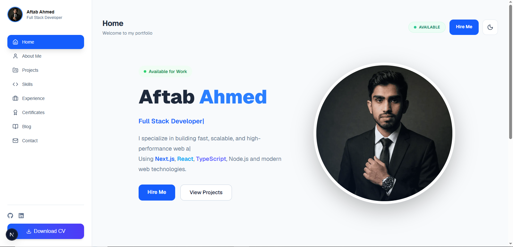

# 🚀 Aftab Ahmed Portfolio

  A modern, responsive, and high-performance developer portfolio built with <strong>Next.js 15</strong>, <strong>React 19</strong>, <strong>TypeScript</strong>, and <strong>Tailwind CSS</strong>.

---

## ✨ Features

* 🎨 Modern & Responsive UI
* 🌙 Dark / Light Mode
* 👨‍💻 Professional About Page
* 💼 Projects Showcase
* 📩 Contact Form
* 📧 Automatic Email Sending
* 🤖 Auto Reply Email System
* 📱 Mobile Friendly Navigation
* ♻️ Clean & Reusable Components
* ⚡ Fast Performance
* 🔍 SEO Optimized
* ✨ Smooth Animations

---

## 🛠️ Tech Stack

### Frontend

* Next.js 15
* React 19
* TypeScript
* Tailwind CSS
* Lucide React

### Backend

* Next.js API Routes
* Nodemailer

### UI & Styling

* Tailwind CSS
* CSS Animations
* Responsive Design

### Development Tools

* Git
* GitHub
* ESLint
* Vercel

---

## 📧 Email System

This portfolio includes a complete email solution:

* Contact Form
* Automatic Email Sending
* Professional HTML Email Templates
* Auto Reply Email System
* Error Handling
* Secure Environment Variables
